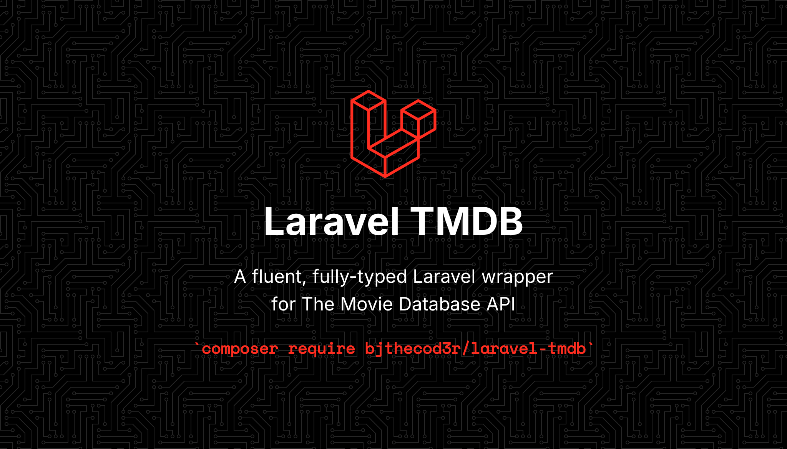

<p align="center">
    
</p>

<p align="center">
    <a href="https://github.com/BJTheCod3r/laravel-tmdb/actions/workflows/tests.yml"></a>
    <a href="https://packagist.org/packages/bjthecod3r/laravel-tmdb"></a>
    <a href="https://packagist.org/packages/bjthecod3r/laravel-tmdb"></a>
    <a href="LICENSE.md"></a>
</p>

# Laravel TMDB

A fluent, fully-typed Laravel wrapper for [The Movie Database (TMDB)](https://developer.themoviedb.org/docs/getting-started) API.

```php
use BjTheCod3r\Tmdb\Facades\Tmdb;

$movie = Tmdb::movies()->details(27205);

$movie->title;          // "Inception"
$movie->year();         // 2010
$movie->genres->pluck('name'); // Illuminate\Support\Collection

Tmdb::image()->url($movie->posterPath, 'w500');
```

Supports **Laravel 11, 12 and 13** on **PHP 8.2+**.

## Installation

```bash
composer require bjthecod3r/laravel-tmdb
```

Publish the config file (optional):

```bash
php artisan vendor:publish --tag=tmdb-config
```

## Configuration

Add your credentials to `.env`. The package prefers the **v4 Read Access Token**
(sent as a `Bearer` header); if it is absent it falls back to the classic **v3
API key** (sent as an `api_key` query parameter).

```dotenv
TMDB_TOKEN=your-read-access-token
# or, for the v3 key:
TMDB_API_KEY=your-api-key

# optional
TMDB_LANGUAGE=en-US
TMDB_REGION=US
TMDB_INCLUDE_ADULT=false
```

You can find both credentials under **Settings → API** in your TMDB account.

## Usage

The `Tmdb` facade exposes one accessor per endpoint group. Calls return typed
[resource objects](#resources); list endpoints return a [`Paginated`](#pagination)
wrapper. Every method accepts an optional `$params` array for extra TMDB query
parameters (`page`, `append_to_response`, `region`, …).

### Movies

```php
Tmdb::movies()->details(27205);
Tmdb::movies()->details(27205, ['append_to_response' => ['credits', 'videos']]);
Tmdb::movies()->credits(27205);          // Credits (cast + crew)
Tmdb::movies()->images(27205);           // Collection<Image>
Tmdb::movies()->videos(27205);           // Collection<Video>
Tmdb::movies()->reviews(27205);          // Paginated<Review>
Tmdb::movies()->recommendations(27205);  // Paginated<Movie>
Tmdb::movies()->similar(27205);          // Paginated<Movie>
Tmdb::movies()->watchProviders(27205);
Tmdb::movies()->popular();
Tmdb::movies()->topRated();
Tmdb::movies()->nowPlaying();
Tmdb::movies()->upcoming();
```

### TV

```php
Tmdb::tv()->details(1396);
Tmdb::tv()->season(1396, 1);             // Season (with episodes)
Tmdb::tv()->episode(1396, 1, 1);         // Episode
Tmdb::tv()->credits(1396);
Tmdb::tv()->popular();
Tmdb::tv()->topRated();
Tmdb::tv()->onTheAir();
Tmdb::tv()->airingToday();
```

### People

```php
Tmdb::people()->details(6193);
Tmdb::people()->movieCredits(6193);
Tmdb::people()->tvCredits(6193);
Tmdb::people()->images(6193);            // Collection<Image>
Tmdb::people()->popular();
```

### Search

```php
Tmdb::search()->movies('inception', ['year' => 2010]); // Paginated<Movie>
Tmdb::search()->tv('breaking bad');                    // Paginated<TvShow>
Tmdb::search()->people('nolan');                       // Paginated<Person>
Tmdb::search()->companies('warner');                   // Paginated<ProductionCompany>
Tmdb::search()->collections('matrix');                 // Paginated<MovieCollection>
Tmdb::search()->keywords('superhero');                 // Paginated<Keyword>

// Multi-search returns mixed media; asResource() promotes each result
// to its concrete type (Movie | TvShow | Person):
Tmdb::search()->multi('matrix')->results->map->asResource();
```

Search and discover requests send the configured `TMDB_INCLUDE_ADULT` default
as `include_adult`; pass `['include_adult' => 'true']` to override per call.

### Discover

`discover()` returns a fluent builder; call `get()` to execute.

```php
Tmdb::discover()->movies()
    ->withGenres([28, 12])          // Action, Adventure
    ->year(2023)
    ->withMinimumVoteAverage(7.5)
    ->sortBy('popularity.desc')
    ->page(1)
    ->get();                        // Paginated<Movie>

// Any TMDB discover filter is available via where():
Tmdb::discover()->tv()->where('with_networks', 213)->get();
```

### Trending

```php
Tmdb::trending()->movies('week');  // Paginated<Movie>
Tmdb::trending()->tv('day');       // Paginated<TvShow>
Tmdb::trending()->people('week');  // Paginated<Person>
Tmdb::trending()->all('day');      // Paginated<MediaResult>
```

### Genres & Configuration

```php
Tmdb::genres()->movies();          // Collection<Genre>
Tmdb::genres()->tv();              // Collection<Genre>

Tmdb::configuration()->details();  // image base URLs & sizes
Tmdb::configuration()->countries();
Tmdb::configuration()->languages();
```

## Resources

Endpoint methods return typed objects (`Movie`, `TvShow`, `Person`, …) with
documented properties — your IDE autocompletes them and dates come back as
`CarbonImmutable` instances:

```php
$movie = Tmdb::movies()->details(27205);

$movie->title;           // string
$movie->releaseDate;     // CarbonImmutable
$movie->voteAverage;     // float
$movie->genres;          // Collection<Genre>
```

Every resource also keeps the raw TMDB payload. Any field — even one not mapped
to a typed property — is reachable via property access, array access, `get()`
(dot notation supported), and `toArray()` / `jsonSerialize()`:

```php
$movie->get('belongs_to_collection.name');
$movie['original_title'];
return $movie; // a controller can return it directly as JSON
```

## Pagination

List endpoints return a `Paginated` wrapper that is iterable and JSON-serializable:

```php
$page = Tmdb::movies()->popular(['page' => 1]);

$page->results;        // Collection<Movie>
$page->page;           // 1
$page->totalPages;     // 500
$page->totalResults;   // 10000
$page->hasMorePages(); // true
$page->nextPage();     // 2

$page->results->each(function (Movie $movie) {
    // ...
});
```

## Image URLs

TMDB resources expose relative image paths. Build absolute URLs with the
`image()` helper (sizes come from `Tmdb::configuration()->details()`):

```php
Tmdb::image()->url($movie->posterPath, 'w500');
Tmdb::image()->original($movie->backdropPath);
```

The CDN root defaults to `https://image.tmdb.org/t/p/` and can be changed via
`TMDB_IMAGE_BASE_URL` (config key `image_base_url`).

## Error handling

Failed requests throw typed exceptions, all extending `TmdbException`:

| Exception | When |
| --- | --- |
| `AuthenticationException` | 401 — invalid/missing credentials |
| `ResourceNotFoundException` | 404 — unknown resource |
| `ValidationException` | 400 / 422 — invalid request |
| `RateLimitException` | 429 — exposes `->retryAfter` (seconds) |
| `ApiException` | connection errors and unexpected 5xx |

If neither credential is configured, an `AuthenticationException` is thrown
before any request is sent.

Rate-limit (429) and 5xx responses to GET requests are retried automatically
per the `retry` config before the exception is thrown, honouring the TMDB
`Retry-After` header when present. Write requests (POST/DELETE) are never
retried, since they are not idempotent.

```php
use BjTheCod3r\Tmdb\Exceptions\ResourceNotFoundException;

try {
    Tmdb::movies()->details(999999999);
} catch (ResourceNotFoundException $e) {
    // ...
}
```

## Dependency injection

The facade is convenient, but you can also type-hint the manager or the
underlying client:

```php
use BjTheCod3r\Tmdb\Tmdb;

public function __construct(private Tmdb $tmdb) {}
```

An escape hatch for endpoints not yet wrapped:

```php
Tmdb::client()->get('movie/27205/keywords');
```

## Testing

Because the client is built on Laravel's `Http` facade, you can fake TMDB in
your own app's tests:

```php
use Illuminate\Support\Facades\Http;

Http::fake([
    'api.themoviedb.org/3/movie/*' => Http::response(['id' => 27205, 'title' => 'Inception']),
]);
```

The package's own suite:

```bash
composer install
vendor/bin/phpunit
```

## License

The MIT License (MIT). See [LICENSE.md](LICENSE.md).
